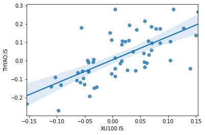
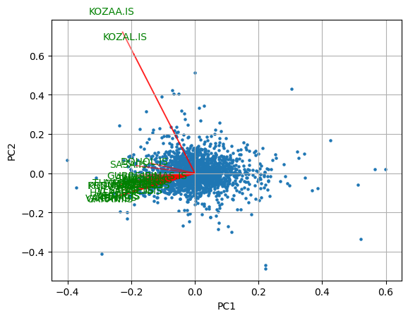
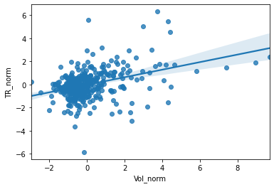
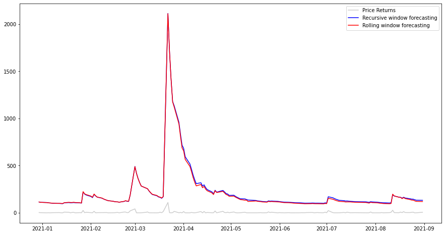
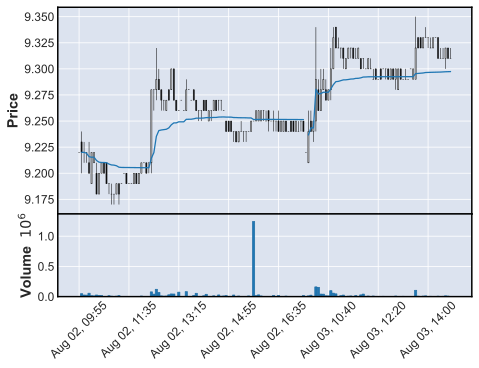

# QuantitaveFinanceExamplesPy

Financial analysis, algorithmic trading, portfolio optimization examples with Python 

DISCLAIMER - No Investment Advice Provided

YASAL UYARI - Burada yer alan yatırım bilgi, yorum ve tavsiyeleri yatırım danışmanlığı kapsamında değildir.

## Examples

### Calculation Alpha and Beta factors



### Cointegration

```
ARCLK.IS and TOASO.IS has cointegration, p-value: 0.04903369798110527
AYGAZ.IS and KCHOL.IS has cointegration, p-value: 0.007029900251131765
FROTO.IS and MAALT.IS has cointegration, p-value: 0.015757028038897322
FROTO.IS and OTKAR.IS has cointegration, p-value: 0.004399007493986555
KCHOL.IS and AYGAZ.IS has cointegration, p-value: 0.007101145930953294
MAALT.IS and FROTO.IS has cointegration, p-value: 0.00783799297255268
OTKAR.IS and FROTO.IS has cointegration, p-value: 0.003094678911810982
OTKAR.IS and TTRAK.IS has cointegration, p-value: 0.04185601871282213
OTKAR.IS and YKGYO.IS has cointegration, p-value: 0.00282083357242191
TTRAK.IS and OTKAR.IS has cointegration, p-value: 0.03639137062922606
TTRAK.IS and YKGYO.IS has cointegration, p-value: 0.03834839887528665
YKGYO.IS and OTKAR.IS has cointegration, p-value: 0.0017665073676291331
YKGYO.IS and TOASO.IS has cointegration, p-value: 0.046004150077470406
YKGYO.IS and TTRAK.IS has cointegration, p-value: 0.027200620035757236
```

### PCA on Returns




### Volatility calculations

```
Std.Dev. Estimator:          0.16988244687319595
Classical Estimator:         0.0013349197336295028
Rogers - Satchell Estimator: 0.0009643228704150725
Yang - Zang estimator:       0.0016329397449278639
```

### Volatility-Volume Relationship



### AR-ARCH models for volatility



### VWAP 


